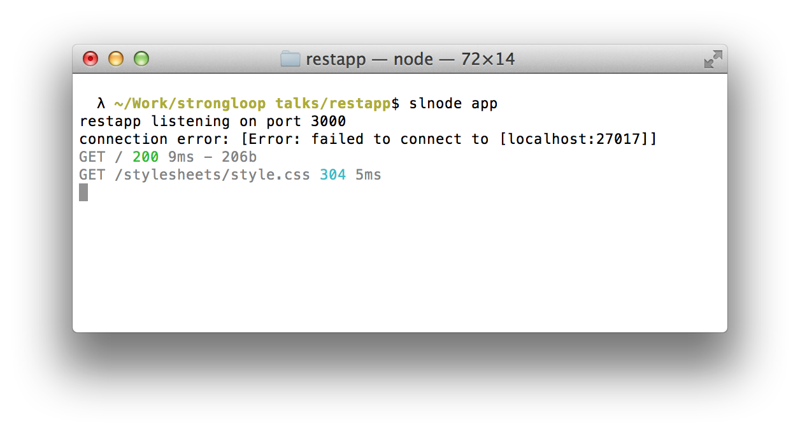
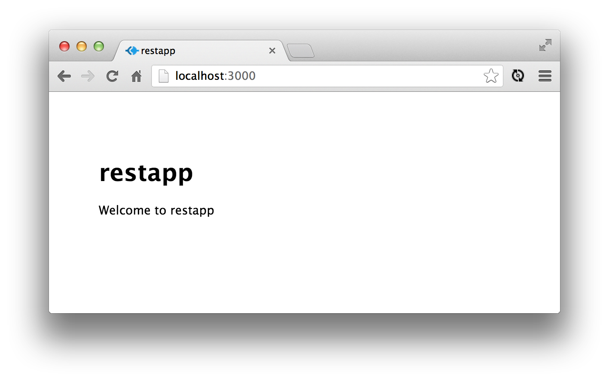

REST API server with Node.js and MongoDB
-------

In this workshop you will build an app that relies on REST data services powered by Node.js and MongoDB.


## Prep

Download the [StrongLoop Node.js distro](http://strongloop.com/products) for your platform and install it.

Next download [MongoDB for your platform](http://www.mongodb.org/downloads) and install it.


What this Workshop Covers
-------

- Scaffolding Express web server
- Set up MongoDB and data
- Setup REST API routes
- View API with Swagger
- Authentication with Passport


Scaffolding Express web server
-------

The StrongLoop Node distro ships with a command-line utility called `slnode` that makes it super simple to scaffold boilerplate applications, modules, CLI utilities, and create test code. This is what we will use to scaffold our express server.

```bash
$ slnode create web restapp -m -r
```

The "m" and "r" flags stand for "mongoose/mongo" and "rest", respectively. Including them means `slnode` will automatically add the mongoose dependency and create some routes for us to play with.

This operation also created a fully-baked express application. Let's fire it up.



And this is what it looks like in the browser:



We can see it didn't connect to our MongoDB server, because we haven't started it up yet. We'll get to that in a second.


Setting up MongoDB
-------

With our application created we need to put some sample data into the database.

A convenient technique for doing this is to create a script that will run when `npm test` is run from the command-line. The test will confirm the database and application are setup properly, and get developers up and running quickly.

We will create a new folder "test" and put the following test code in there, which is written in Node.

```bash
~/Work/serverapp $ cd test
~/Work/serverapp/test $ vi db.js
```

Then, put [this test code in there](https://github.com/strongloop/sample-blog/blob/master/test/routes-mocha.js).

To run this with `npm test`, add this to the package.json file in your application's root directory:

```javascript
"scripts": {
  "test": "./node_modules/mocha/bin/mocha --timeout 30000 --reporter spec test/*-mocha.js --noAuth --noSetup"
},
```

As you can see it uses the [mocha testing framework](http://visionmedia.github.io/mocha/), so we need to install that first with `npm install mocha` from the serverapp root directory:

```bash
~/Work/serverapp $ npm install mocha
```

Don't run `npm test` quite yet though, we need to get Mongo up and running first.


### Get MongoDB up and running

Earlier we downloaded [MongoDB](http://www.mongodb.org/downloads) and installed it. Now we are going to start it up and configure it for use in development and production.

(fill in content on setting up the database, with naming it, auth, etc)


### Update the database config for our app

In db/config.js is the configuration for connecting to the database:

```javascript
/**
 * Configuration for MongoDB
 */
exports.mongodb = {
  development: {
    'hostname': 'localhost',
    'port': 27017,
    'username': '',
    'password': '',
    'name': '',
    'db': 'restapp_development'
  }
}
```

This is used by the mongoose connection code in db/mongo-store.js.

(Mike any details they should update for development and production?)


### npm test

Now let's run `npm test` again to ensure our Mongo instance is set up properly. We should see a successful pass of the test data. Let's look inside our mongo instance to see that the data is actually there.

(Mike how can audience members peek inside the mongo instance and see the data is actually there? I'm not that familiar with MongoDB)


Setup REST API Routes
-------

If a client is accessing some API route from from our server, we can return the data as JSON or a rendered webpage. Both situations are useful, particularly in light of slow mobile connections. We may want to render the webpage upon first access and then allow the client javascript to make AJAX requests to specific resources, only updating the parts of the webpage that need to be updated.